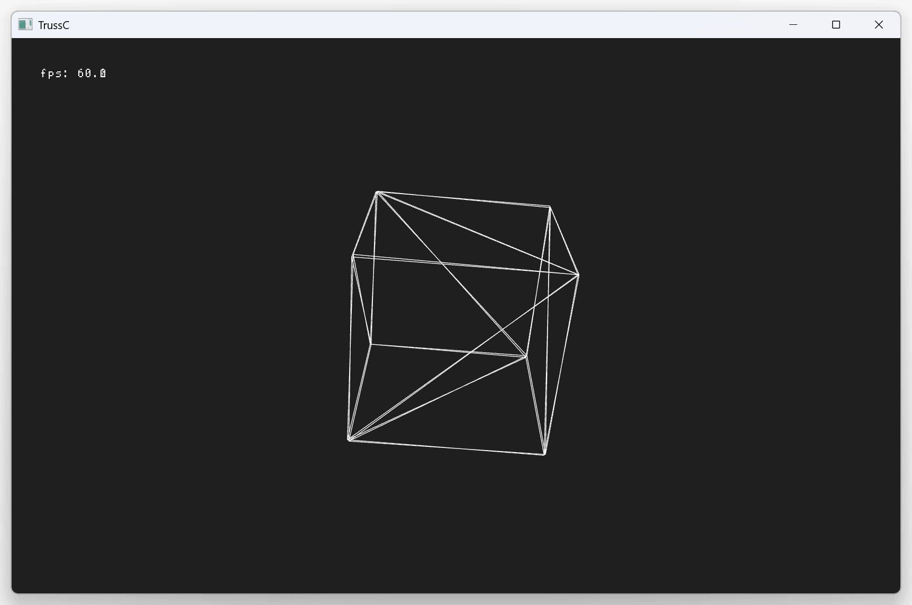

# JlTrussCTest.jl

TrussC C++ call test from Julia using using [tcxJuliaCxxWrap](https://github.com/funatsufumiya/tcxJuliaCxxWrap)

## Usage

### 1. Build cpp code (using CMake)

Please use `trusscli` of TrussC project, and add tcxJuliaCxxWrap and build it.

See https://github.com/funatsufumiya/tcxJuliaCxxWrap

Then copy `.dll`/`.so`/`.dylib` into lib folder (file name should be `libJlTrussC.xxx` even on Windows DLL.)

### 2. Run julia code

```bash
$ julia --project=@. -e 'using Pkg; Pkg.instantiate()'
$ julia --project=@. -e 'using JlTrussCTest; JlTrussCTest.main();'
```



> [!Warning]
> ***Windows CxxWrap.jl issue***<br><br>
> If not working CxxWrap.jl on Windows, you need to try [Building libcxxwrap-julia](https://github.com/JuliaInterop/libcxxwrap-julia#building-libcxxwrap-julia) (Because prebuilt packaged dll for CxxWrap.jl is not compatible with MSVC). Please see https://github.com/funatsufumiya/CxxWrapTest.jl or https://github.com/JuliaInterop/CxxWrap.jl in detail.
